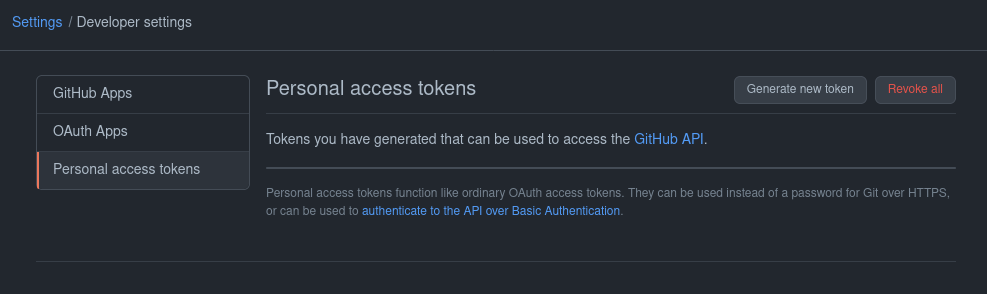
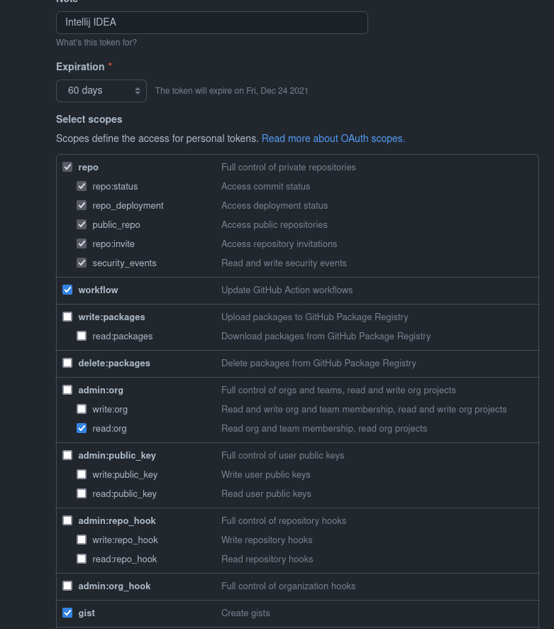
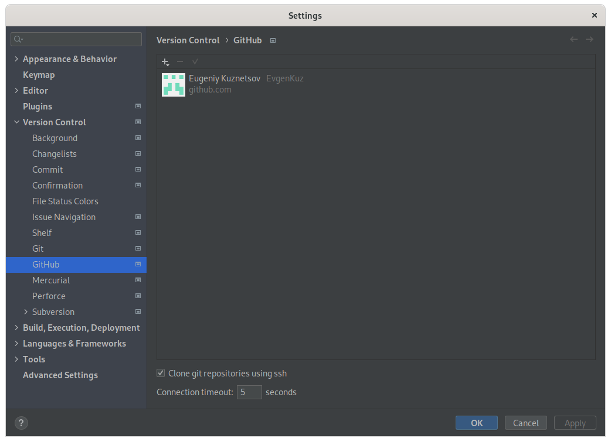
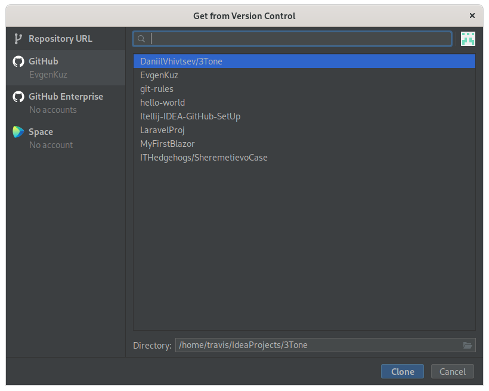
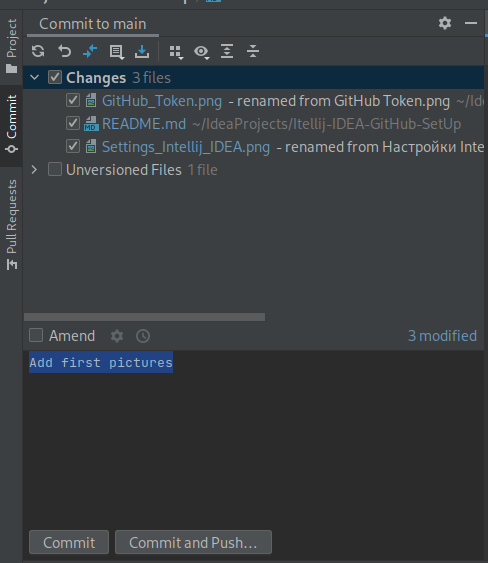
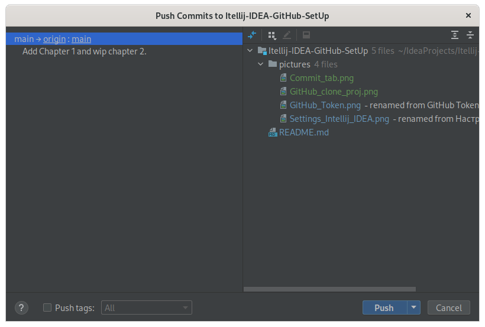
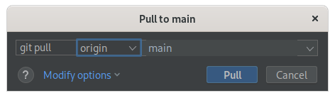

# Настройка Git и GitHub в Intellij IDEA

## 1. Добавить аккаунт GitHub в Intellij IDEA

### 1.1 Создать access token

*Перейди в настройки GitHub -> Developer Settings -> Personal access token
-> Generate new token*

Оставьте только scope'ы: repo, workflow, read:org и gist.

Появится токен. **Обязательно скопируйте его, потому что после того, как вы закроете страницу, он пропадёт!**

### 1.2 Добавить аккаунт в Intellij IDEA

Зайдите в Intellij IDEA. Там *File->Settings->Version Control->GitHub*.

Там уже нажмите *Ctrl+N(на Mac Cmd+N)->Login with token*. И просто вставьте ваш скопированный токен в поле.
Add account. *Поздравляю, вы добавили GitHub аккаунт!*

---
## 2. Применение

### 2.1 Скачать проект с GitHub

Для того чтобы клонировать проект, достаточно зайти в *File->New->Project from Version Control*.

Теперь достаточно выбрать проект и нажать *Clone*.

### 2.2 Сделать Commit

Достаточно нажать *Git->Commit*. Откроется вкладка *Commit*.

В *Unversioned Files* находятся файлы не добавленные в *staging area*. 
Там можно их добавить, чтобы они попали в следующий коммит.
В *Changes* можно убрать файлы, которые не должны попасть в следующий коммит.

Когда файлы выбранный, можно написать сообщение для коммита и сделать его, нажав кнопку *Commit*.

### 2.3 Сделать Push

Это можно сделать из той же вкладки, нажав *Commit and Push*, 
после чего файлы загрузятся на удалённый репозиторий.

Так же это можно сделать перейдя *Git->Push*

В открывшемся окне можно выбрать необходимые коммиты и запушить их на удалённый репозиторий.

### 2.4 Загрузить через Fetch

Делается *Git->Fetch*.

Fetch безопасен всегда, поэтому его можно использовать когда угодно. 
Он просто загружает все изменения с удалённого репозитория, не делая merge с локальным репозиторием.
Т.е. загруженные изменения не применятся, а останутся в отдельных ветках, расходящихся с вашими 
на последнем запушеном коммите.

Подходить, если вам нужно сделать Merge с изменениями из-вне вручную.

### 2.5 Загрузить через Pull

Pull работает только, если можно сделать fast-forward merge для веток с одинаковыми названиями в
удалённом репозитории и в локальном.

Делается *Git->Pull*.

В окне можно выбрать ветку, которую надо обновить из удалённого репозитория. Если удалённых 
репозиториев несколько, то их тоже можно выбрать.

Так же там можно добавить специальные опции, но они требуют отдельного объяснения.